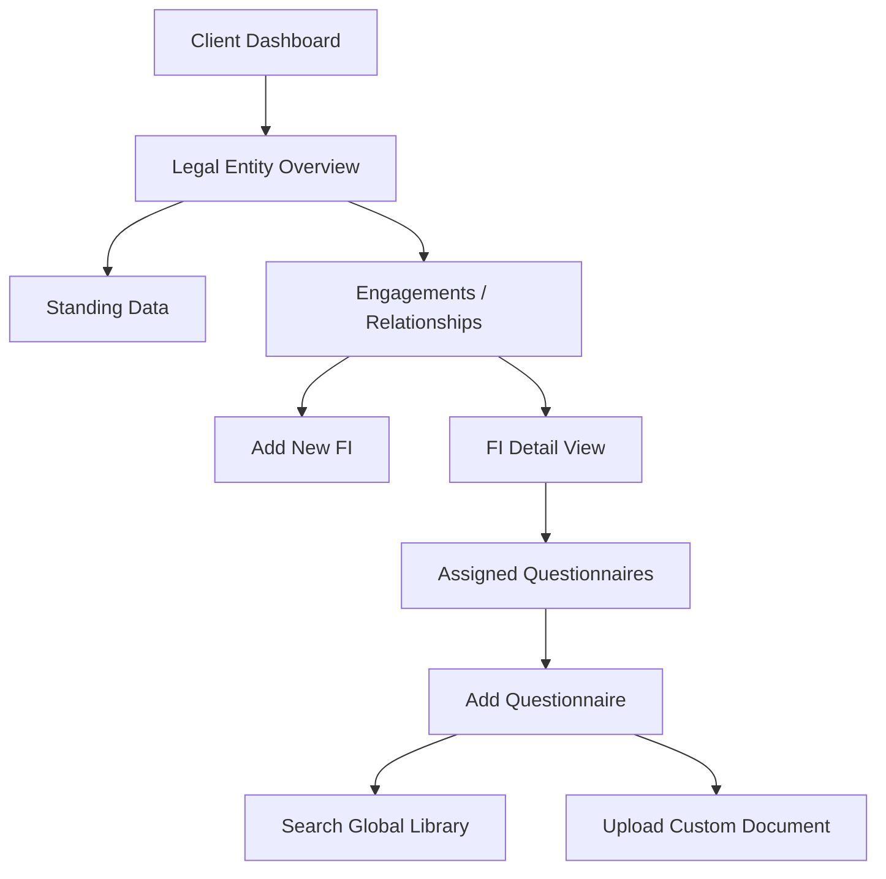

# Client UX Design Package: Financial Institution Onboarding & Questionnaire Management

## 1. Executive Summary
This document outlines the user experience requirements for the **Client Project Manager** persona. The goal is to design a premium, intuitive workflow for onboarding Financial Institutions (FIs) and proactively managing compliance questionnaires. This package serves as the "Brief" for a Product Designer.

---

## 2. Persona: "Alex" (Client Compliance Lead)
*   **Role**: Senior Compliance Officer / Project Manager at a mid-to-large Asset Manager.
*   **Mindset**: "I want to be proactive, not reactive. I want my data to be ready *before* the bank asks for it."
*   **Pain Points**: 
    *   Scrambling to find the right document when an FI emails.
    *   Repeatedly filling out the same or similar Excel/Word forms.
    *   Not knowing which FI has which version of their data.
*   **Goals**: 
    *   Invite FIs to the platform to view their data (securely).
    *   Digitize their standard questionnaires so they can auto-fill them.
    *   Maintain a "Single Source of Truth".

---

## 3. Required Design Artifacts
To successfully execute this design, the following artifacts are required:

1.  **User Journey Maps**: High-level flow of the "Invite" and "Build" processes (Provided below).
2.  **Information Architecture (Site Map)**: Where these new pages live in the hierarchy.
3.  **Wireframes / Low-Fi Mockups**:
    *   **"Engagements" Dashboard**: List of active FIs and their status.
    *   **"Questionnaire Library"**: Grid of available standard forms vs. custom uploads.
    *   **"Digitization Workbench"**: Split-screen view for uploading a PDF and verifying existing fields.
4.  **Interactive Prototype**: A click-through of the "Invite FI -> Assign Questionnaire" flow.

---

## 4. User Journeys

### Journey A: Inviting & Onboarding a Financial Institution
**Goal**: Alex wants to grant "Bank of America" access to their automated data.

1.  **Trigger**: Alex receives an email from BoA asking for KYC refresh.
2.  **Action**: Alex logs into Compass and navigates to **"Relationships"** (or "Engagements").
3.  **Step**: Clicks "Add Financial Institution".
4.  **Input**: Searches for "Bank of America" in the global directory OR enters "New FI" details (Name, Email of contact).
5.  **Config**: Selects which **Legal Entity** (fund) this FI interacts with.
6.  **Outcome**: 
    *   An invite email is sent to the FI (if new).
    *   A new "Engagement" is created in the dashboard with status `PENDING`.

### Journey B: Ensuring Correct Questionnaires ("The Proactive Build")
**Goal**: Alex knows BoA uses the "Wolfsberg CBPQ" (Standard) and a custom "BoA ESG Addendum". He wants to have these ready.

1.  **Trigger**: Preparing for the BoA Invite.
2.  **Action**: Navigate to **"Questionnaires"** tab within the BoA Engagement.
3.  **Choice**: 
    *   *Option A (Library)*: Search "Wolfsberg CBPQ v1.4". Click "Add to Engagement".
    *   *Option B (Upload)*: Select "Upload Custom Questionnaire". Uploads `BoA_ESG_2025.pdf`.
4.  **Digitization (The "Magical" Step)**:
    *   System analyzes the PDF.
    *   User sees a "Review Extraction" screen (The Workbench).
    *   User verifies the questions are correctly identified.
5.  **Outcome**: Both questionnaires appear in the list. The system immediately attempts to **Pre-Fill** them using stored Standing Data.

---

## 5. Functional Requirements (UI) & Information Hierarchy

### 5.1 Hierarchy
The Compass Client experience is strictly hierarchical to handle complex Asset Management structures:
1.  **Client Workspace** (The User's Context)
2.  **Organization (Legal Entity)**: The specific Fund or Entity being managed. (e.g., "Acme Global Fund A").
    *   *User selects this first.*
3.  **Financial Institution (Engagement)**: The relationship with a bank for that specific LE. (e.g., "Bank of America" for "Fund A").
4.  **Questionnaires**: The compliance tasks within that relationship.

### 5.2 The Questionnaire Ecology
There are three distinct sources of questionnaires:
1.  **FI-Published ("Inherited")**: The FI has curated and published this form. They own the versioning. The Client sees it automatically.
2.  **Client-Created ("Digitized")**: Alex uploads a PDF/Doc to digitization.
3.  **Client Library**: A repository of Client-Created forms that can be reused across multiple Legal Entities.

### 5.3 The "Relationships" Dashboard (Context: Single Legal Entity)
*   **Layout**: Card or Table view of connected FIs *for the selected LE*.
*   **Key Data**: FI Name, Status, # of Open Questionnaires.
*   **Primary Action**: "Connect/Invite FI".

### 5.4 The Questionnaire Library / Import Wizard
*   **Visual**: A rich "App Store" style grid.
*   **Sources**:
    *   **"From Engagement"**: What the FI has published for you.
    *   **"My Library"**: Usage of forms you've digitized previously.
    *   **"Upload New"**: Digitizing a fresh document.

---

## 6. Information Architecture Update

